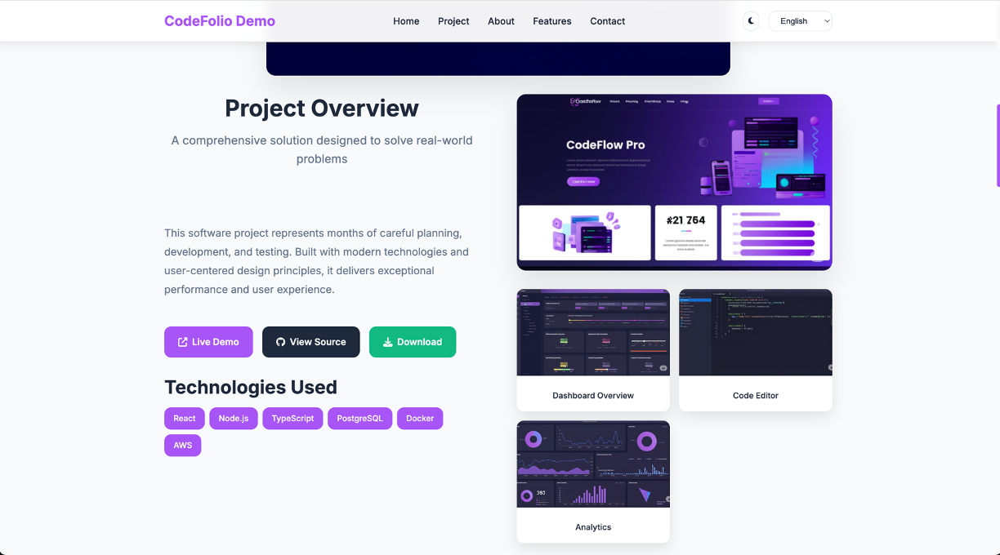

# CodeFolio - Modern Jekyll Theme for Software Portfolios

A beautiful, modern Jekyll theme designed specifically for showcasing software products and developer portfolios. Features a clean design, dark mode support, multi-language capabilities, and responsive layout.

[](https://gradinnovate.github.io/CodeFolio/)

## ✨ Features

- **Modular Design**: Flexible module system - enable/disable sections as needed
- **Modern UI**: Clean, professional layout with beautiful typography
- **Responsive**: Mobile-first design that works perfectly on all devices
- **Multi-theme Support**: 6 built-in color themes with easy switching
- **Dark Mode**: Built-in dark/light theme toggle with user preference memory
- **Multi-language**: Support for English, Traditional Chinese, and Simplified Chinese
- **Single Page**: Complete portfolio in one scrollable page
- **Project Showcase**: Comprehensive project/product presentation with video support
- **Contact Form**: Integrated contact form with Formspree integration
- **Video Demo**: Built-in video player for product demonstrations
- **Testimonials**: Client testimonials display module
- **Feature Highlights**: Showcase key features and capabilities
- **About Section**: Personal/company information with stats and skills
- **SEO Optimized**: Built-in SEO features and meta tags
- **Dev Container**: Ready-to-use development environment with Docker
- **Auto Deployment**: GitHub Actions workflow for automatic deployment to GitHub Pages

## 🚀 Quick Start

### Prerequisites

- [Docker](https://www.docker.com/get-started) installed on your machine
- [Visual Studio Code](https://code.visualstudio.com/) with the [Dev Containers extension](https://marketplace.visualstudio.com/items?itemName=ms-vscode-remote.remote-containers)

## 🚀 Quick Setup for GitHub Pages

**Before development**, configure your site settings in `_config.yml`:

```yaml
# Site settings
title: "Your Portfolio Name"
email: your-email@example.com
description: "Your portfolio description"
baseurl: "/your-repo-name" # For project pages (e.g., "/portfolio")
url: "https://yourusername.github.io" # Your GitHub Pages URL

# OR for user/organization pages:
baseurl: "" # Leave empty for user pages
url: "https://yourusername.github.io" # Your GitHub Pages URL
```

**Important**:

- For **project pages** (repository name like `portfolio`, `my-site`): set `baseurl: "/repository-name"`
- For **user pages** (repository name like `username.github.io`): set `baseurl: ""`

### Installation

1. Use this template to create your repository:
   - Click the "Use this template" button on GitHub
   - Create a new repository from this template
   - Clone your new repository:

2. Open in VS Code

3. When prompted, click "Reopen in Container" or use the Command Palette (`Ctrl+Shift+P` / `Cmd+Shift+P`) and select "Dev Containers: Reopen in Container"

4. The dev container will automatically:
   - Install Ruby, Jekyll, and all dependencies
   - Install Node.js and Prettier for code formatting
   - Start the development server and watch for changes
   - Set up VS Code extensions for Jekyll/Liquid development
   - Configure live reload for instant preview

5. Once the container is ready, open your browser and visit `http://localhost:8080`

## 📁 Project Structure

```
codefolio/
├── .devcontainer/
│   └── devcontainer.json   # Dev Container configuration
├── .github/
│   └── workflows/
│       └── deploy.yml      # GitHub Actions deployment workflow
├── _config.yml              # Main configuration
├── _layouts/
│   ├── default.html         # Default layout
│   └── modular.html         # Modular layout for dynamic content
├── _data/
│   ├── languages/           # Multi-language support
│   │   ├── en.yml          # English translations
│   │   ├── zh-TW.yml       # Traditional Chinese
│   │   └── zh-CN.yml       # Simplified Chinese
│   └── modules.yml         # Module configuration
├── _includes/
│   └── modules/            # Modular template components
│       ├── hero.html       # Hero section
│       ├── project.html    # Project showcase
│       ├── about.html      # About section
│       ├── features.html   # Features grid
│       ├── video_demo.html # Video demonstration
│       ├── testimonials.html # Testimonials carousel
│       └── contact.html    # Contact form
├── assets/
│   ├── css/
│   │   └── main.css        # Main stylesheet with theme support
│   ├── js/
│   │   └── main.js         # JavaScript functionality
│   ├── images/             # Image assets
│   └── videos/             # Video assets
├── index.md                # Main page (English)
├── index-zh-tw.md          # Traditional Chinese page
├── index-zh-cn.md          # Simplified Chinese page
├── about.md                # About page (English)
├── about-zh-tw.md          # About page (Traditional Chinese)
└── about-simple.md         # Simple about page
```

## ⚙️ Configuration

### Basic Settings

Edit `_config.yml` to customize your site:

```yaml
# Site settings
title: "Your Portfolio Name"
email: your-email@example.com
description: "Your portfolio description"

# Language settings
default_lang: en
languages: ["en", "zh-TW", "zh-CN"]

# Color theme settings
color_theme: "default" # default, ocean, emerald, sunset, rose, cyberpunk
show_color_theme_switcher: false # Set to true for development

# Contact form settings (Formspree)
formspree:
  enabled: true
  endpoint: "https://formspree.io/f/your-form-id"

# Social media links
social:
  github: your-github-username
  linkedin: your-linkedin-username
  email: your-email@example.com
```

### Configuring Modules

This theme uses a modular approach where all content is configured in the front matter of your markdown files. Edit `index.md` to configure your page modules:

```yaml
---
layout: modular
title: Home
lang: en

modules:
  # Hero module (required)
  hero:
    enabled: true
    title: "Your Name"
    subtitle: "Your Title/Tagline"
    description: "Brief description of what you do"
    cta_text: "Get Started"
    cta_link: "#project"
    hero_image: "/assets/images/hero-avatar.png"

  # Project showcase module
  project:
    enabled: true
    title: "Project Name"
    subtitle: "Project tagline"
    description: "Detailed project description"
    promo_video: "/assets/videos/demo.mp4"
    main_image: "/assets/images/project-preview.jpg"
    demo_url: "https://your-demo.com"
    github_url: "https://github.com/username/repo"
    technologies: ["React", "Node.js", "TypeScript"]

  # About section
  about:
    enabled: true
    title: "About Me"
    description: "Your background and experience"
    about_image: "/assets/images/about.jpg"
    stats:
      projects: "50+"
      clients: "30+"
      experience: "5+"
    skills:
      - name: "Frontend Development"
        icon: "fas fa-code"
        description: "Building user interfaces"

  # Features module
  features:
    enabled: true
    title: "Key Features"
    features_list:
      - title: "Feature Name"
        icon: "fas fa-rocket"
        description: "Feature description"

  # Video demo module
  video_demo:
    enabled: true
    title: "Product Demo"
    description: "Watch the product in action"
    demo_video: "/assets/videos/demo.mp4"

  # Testimonials module
  testimonials:
    enabled: true
    title: "What Clients Say"
    testimonials_list:
      - content: "Great work!"
        author: "Client Name"
        position: "Job Title"
        company: "Company Name"
        avatar: "/assets/images/testimonials/client.jpg"

  # Contact form module
  contact:
    enabled: true
    title: "Get In Touch"
    subtitle: "Ready to work together?"
    contact_form_enabled: true
---
```

#### Available Modules

- **hero** - Hero section with title, subtitle, CTA button (required)
- **project** - Main project/product showcase with video and images
- **about** - About section with description, stats, and skills
- **features** - Feature highlights grid
- **video_demo** - Standalone video demonstration
- **testimonials** - Client testimonials carousel
- **contact** - Contact form and information

## 📋 Detailed Module Documentation

### Core Principles

✅ **Configuration in Markdown** - All content, styling, and behavior configured in MD files  
✅ **Pure HTML Rendering** - Templates only handle display, no fallback logic  
✅ **Complete Control** - What you see is exactly what you define in MD  
✅ **No Hidden Logic** - No complex default values or automatic inference

### Module Structure

```yaml
---
layout: modular
title: Your Page Title
lang: en

modules:
  module_name:
    enabled: true
    # Define all settings here...
---
```

### 1. Hero Module (Recommended)

The hero module is the main banner section of your page.

```yaml
hero:
  enabled: true
  title: "Your Name or Brand" # Required
  subtitle: "Your Title" # Optional
  description: "Brief description" # Optional
  cta_text: "Button Text" # Optional, requires cta_link
  cta_link: "#section" # Optional, requires cta_text
  hero_image: "/path/to/image" # Optional
```

### 2. Project Module

Showcase your main project or product with rich media support.

```yaml
project:
  enabled: true
  title: "Project Title" # Optional
  subtitle: "Project Subtitle" # Optional
  description: "Project description" # Optional
  promo_video: "/path/to/video" # Optional
  main_image: "/path/to/image" # Optional
  demo_url: "https://demo.com" # Optional
  github_url: "https://github.com/user/repo" # Optional
  download_url: "https://releases.com" # Optional
  technologies: # Optional
    - "React"
    - "Node.js"
    - "TypeScript"
  screenshots: # Optional
    - title: "Screenshot Title"
      image: "/path/to/screenshot"
```

### 3. About Module

Present information about yourself or your company.

```yaml
about:
  enabled: true
  title: "About Title" # Optional
  description: "Detailed description" # Optional
  about_image: "/path/to/image" # Optional
  stats: # Optional, all sub-items optional
    projects: "50+"
    clients: "30+"
    experience: "5+"
  skills: # Optional
    - name: "Skill Name" # Required for each skill
      icon: "fas fa-code" # Optional
      description: "Skill description" # Optional
```

### 4. Features Module

Highlight key features or capabilities.

```yaml
features:
  enabled: true
  title: "Features Title" # Optional
  subtitle: "Features Subtitle" # Optional
  features_list: # Requires at least one feature
    - title: "Feature Name" # Required for each feature
      icon: "fas fa-rocket" # Optional
      description: "Feature description" # Optional
      image: "/path/to/image" # Optional
```

### 5. Video Demo Module

Dedicated section for product demonstrations.

```yaml
video_demo:
  enabled: true
  demo_video: "/path/to/video" # Required - no video, no module
  title: "Video Title" # Optional
  description: "Video description" # Optional
  demo_url: "https://demo.com" # Optional
```

### 6. Testimonials Module

Display client testimonials and reviews.

```yaml
testimonials:
  enabled: true
  title: "Testimonials Title" # Optional
  testimonials_list: # Requires at least one testimonial
    - content: "Testimonial content" # Optional
      author: "Client Name" # Optional
      position: "Job Title" # Optional
      company: "Company Name" # Optional
      avatar: "/path/to/avatar" # Optional
```

### 7. Contact Module

Contact form and information section.

```yaml
contact:
  enabled: true
  title: "Contact Title" # Optional
  subtitle: "Contact Subtitle" # Optional
  contact_form_enabled: true # Optional, show contact form
  contact_email: "contact@example.com" # Optional
  show_social: true # Optional, show social media links
```

### Complete Examples

#### Minimal Page Setup

```yaml
---
layout: modular
title: "My Portfolio"

modules:
  hero:
    enabled: true
    title: "John Doe"
    description: "Frontend Developer"
---
```

#### Full Product Showcase

```yaml
---
layout: modular
title: "My Product"

modules:
  hero:
    enabled: true
    title: "Amazing Software"
    subtitle: "Solving Your Problems"
    description: "This is an amazing piece of software"
    cta_text: "Learn More"
    cta_link: "#project"

  project:
    enabled: true
    title: "Product Overview"
    description: "This software helps you..."
    promo_video: "/assets/videos/intro.mp4"
    demo_url: "https://demo.example.com"
    technologies: ["React", "Node.js", "PostgreSQL"]

  features:
    enabled: true
    title: "Key Features"
    features_list:
      - title: "Fast Performance"
        icon: "fas fa-bolt"
        description: "Lightning-fast response times"
      - title: "Easy to Use"
        icon: "fas fa-user-friendly"
        description: "Intuitive user interface"

  contact:
    enabled: true
    title: "Get Started"
    contact_form_enabled: true
    contact_email: "hello@example.com"
---
```

### Important Notes

1. **No Default Values** - If you don't define a setting in MD, related content won't display
2. **Required Fields** - Each module has very few required fields, most are optional
3. **Conditional Display** - Some modules like `video_demo` require specific fields to display
4. **Flexible Composition** - Enable only the modules you need, in any order
5. **Complete Control** - What you define in MD is exactly what appears on the page

### Troubleshooting

If a module isn't displaying expected content:

1. Check that `enabled: true` is correctly set
2. Verify required fields are filled
3. Check YAML syntax (indentation, colons, etc.)
4. Verify file paths are correct
5. Ensure the module appears in the `modules:` section

This design gives you complete control over page content with no hidden logic or unexpected defaults!

## 🌍 Multi-language Support

The theme supports multiple languages through YAML data files and separate markdown files for each language.

### Language Files Structure

- `_data/languages/en.yml` - English translations
- `_data/languages/zh-TW.yml` - Traditional Chinese translations
- `_data/languages/zh-CN.yml` - Simplified Chinese translations

### Page Files

- `index.md` - English homepage
- `index-zh-tw.md` - Traditional Chinese homepage
- `index-zh-cn.md` - Simplified Chinese homepage

### Adding a New Language

1. **Create language data file**: Add a new YAML file in `_data/languages/` (e.g., `fr.yml` for French)
2. **Update config**: Add the language code to the `languages` array in `_config.yml`
3. **Create page file**: Create a new markdown file with the language suffix (e.g., `index-fr.md`)
4. **Set language in front matter**:
   ```yaml
   ---
   layout: modular
   title: Home
   lang: fr
   modules:
     # ... your module configuration
   ---
   ```

### Language Switching

The theme includes an automatic language switcher in the navigation. Users can switch between available languages, and the theme will:

- Load the appropriate language data
- Navigate to the corresponding page
- Remember the user's language preference

## 🎨 Customization

### Colors

The theme uses CSS custom properties for easy color customization. Edit the `:root` section in `assets/css/main.css`:

```css
:root {
  --primary-color: #4f46e5;
  --secondary-color: #fbbf24;
  --accent-color: #06b6d4;
  /* ... more colors */
}
```

### Typography

The theme uses Inter font by default. You can change it by updating the `--font-primary` variable:

```css
:root {
  --font-primary: "Your Font", sans-serif;
}
```

### Sections

You can modify or add sections by editing `index.md`. Each section uses Liquid templating to display dynamic content.

## 🎨 Color Theme Configuration

### Overview

The color theme selector button's visibility is controlled by settings in `_config.yml`. During development, you can display the selector for testing, and hide it for production deployment while using the configured theme.

### Available Color Themes

- `default` - Default theme (blue-purple gradient)
- `ocean` - Ocean theme (blue gradient)
- `emerald` - Emerald theme (green gradient)
- `sunset` - Sunset theme (orange-yellow gradient)
- `rose` - Rose theme (pink gradient)
- `cyberpunk` - Cyberpunk theme (purple gradient)

### Configuration Method

Set the theme and selector visibility in `_config.yml`:

```yaml
# _config.yml
color_theme: "ocean" # Set website theme
show_color_theme_switcher: true # Whether to show theme selector button

# Other configurations...
title: "CodeFolio"
description: "Modern Developer Portfolio"
```

### Default Values

If `color_theme` is not set in `_config.yml`, the system will automatically use the `default` theme.

### Theme Selector Control

#### Show Selector (Development)

```yaml
# _config.yml
show_color_theme_switcher: true
```

- Display color theme selector button
- Can switch themes in real-time for testing
- Suitable for development phase

#### Hide Selector (Production)

```yaml
# _config.yml
show_color_theme_switcher: false
```

- Hide color theme selector button
- Automatically apply configured theme
- Suitable for production deployment

### Configuration Examples

#### Development Settings (Show Selector)

```yaml
# _config.yml
title: CodeFolio
color_theme: "ocean"
show_color_theme_switcher: true # Show selector for testing
# ... other configurations
```

#### Production Settings (Hide Selector)

```yaml
# _config.yml
title: CodeFolio
color_theme: "emerald"
show_color_theme_switcher: false # Hide selector
# ... other configurations
```

#### Using Default Theme

```yaml
# _config.yml
title: CodeFolio
color_theme: "default"
show_color_theme_switcher: false
# ... other configurations
```

### Important Notes

1. **Theme names are case-sensitive** - Please use lowercase
2. **Invalid theme names** - Will automatically fallback to `default` theme
3. **Selector control** - Use `show_color_theme_switcher` to control button visibility
4. **Development testing** - Set `show_color_theme_switcher: true` to test different theme effects
5. **Pre-deployment confirmation** - Ensure correct theme name and set `show_color_theme_switcher` to `false`
6. **Container restart** - After modifying `_config.yml`, restart the Dev Container for changes to take effect

### Custom Themes

To add new color themes, please add corresponding CSS variable definitions in `assets/css/main.css`.

## 📧 Contact Form Setup (Formspree)

### Why Choose Formspree?

Formspree is the best choice for GitHub Pages users because:

- ✅ **Fully compatible with GitHub Pages** - Pure static website solution
- ✅ **Sufficient free plan** - 50 form submissions per month
- ✅ **Automatic spam protection** - Built-in honeypot and other protection mechanisms
- ✅ **No backend required** - Direct frontend processing
- ✅ **Email notifications** - Automatically send form content to your mailbox

### Setup Steps

#### 1. Register Formspree Account

1. Go to [Formspree.io](https://formspree.io)
2. Click "Get Started"
3. Register for a free account

#### 2. Create New Form

1. After logging in, click "New Form"
2. Enter form name (e.g., Portfolio Contact Form)
3. Enter your email address (to receive messages)
4. Click "Create Form"

#### 3. Get Form ID

After creating the form, you'll see a URL like this:

```
https://formspree.io/f/xzbwpklr
```

Where `xzbwpklr` is your form ID.

#### 4. Configure \_config.yml

Add your form endpoint URL to `_config.yml`:

```yaml
# Contact form settings (Formspree)
formspree:
  enabled: true # Enable Formspree contact form
  endpoint: "https://formspree.io/f/xzbwpklr" # Replace with your actual endpoint URL
```

#### 5. Test Form

1. Restart the Dev Container
2. Go to contact page
3. Fill out and submit the form
4. First submission will require email verification
5. After verification, the form will work normally

### Form Features

#### Included Features

- **Name** - Sender's name
- **Email** - Sender's email (for replies)
- **Subject** - Message subject
- **Message** - Message content
- **Anti-spam** - Honeypot hidden field
- **Submission Status** - Loading animation and success/error notifications

#### Automatic Processing

- ✅ Form validation
- ✅ Spam filtering
- ✅ Email sending
- ✅ Error handling
- ✅ Success confirmation

### Customization Options

#### 1. Modify Form Fields

Edit in `_includes/modules/contact.html`:

```html
<!-- Add new field -->
<div class="form-group">
  <label for="phone">Phone (Optional)</label>
  <input type="tel" id="phone" name="phone" />
</div>
```

#### 2. Custom Confirmation Page

Set in Formspree dashboard:

- Custom success page URL
- Custom email template
- Auto-reply settings

#### 3. Advanced Settings

```html
<!-- Hidden fields (not shown to users) -->
<input type="hidden" name="_subject" value="New Portfolio Contact" />
<input type="hidden" name="_cc" value="backup@example.com" />

<!-- Custom redirect -->
<input type="hidden" name="_next" value="https://yourdomain.com/thanks" />
```

### Deployment to GitHub Pages

1. Push code to GitHub
2. Enable GitHub Pages in repository settings
3. Form will automatically work on your website

### Monitoring and Analytics

In the Formspree dashboard you can:

- 📈 View submission statistics
- 📧 Manage received messages
- 🔧 Adjust settings
- 💾 Export data

### Important Notes

1. **Free limitations** - 50 submissions per month (sufficient for personal portfolios)
2. **First-time verification** - Email verification required on first use
3. **Spam protection** - Formspree automatically filters most spam
4. **Backup** - Important messages should be regularly exported from Formspree dashboard

### Troubleshooting

#### Form Not Working?

1. Check `formspree.endpoint` in `_config.yml`
2. Restart the Dev Container if needed
3. Check browser console for errors
4. Confirm Formspree form is verified

## 📱 Responsive Design

The theme is built mobile-first and includes:

- Flexible grid layouts
- Responsive images
- Mobile-optimized navigation
- Touch-friendly interactions
- Optimized performance on all devices

## 🔧 Development

### Development

The project is configured with a Dev Container that provides a consistent development environment:

- **Automatic Setup**: All dependencies are automatically installed
- **Code Formatting**: Prettier is pre-configured and runs on save
- **Extensions**: Jekyll/Liquid syntax highlighting and Markdown support
- **Live Reload**: Development server automatically restarts on changes

#### Dev Container Features

The Dev Container automatically handles all compilation and development tasks:

- **Auto-start**: Jekyll development server starts automatically on container startup
- **Live reload**: Changes are automatically detected and the site rebuilds
- **Auto-formatting**: Prettier formats your code on save
- **Port forwarding**: Site is accessible at `http://localhost:8080`
- **Dependencies**: All Ruby gems and Node packages are pre-installed

No manual commands needed - just edit your files and see changes instantly!

### Adding JavaScript Functionality

All JavaScript is contained in `assets/js/main.js`. The file includes:

- Navigation handling
- Dark mode toggle
- Testimonials slider
- Contact form validation
- Scroll animations
- Performance optimizations

## 🚀 Deployment

### GitHub Pages with GitHub Actions

This repository includes a pre-configured GitHub Actions workflow for automatic deployment to GitHub Pages.

#### Initial Setup

1. **Enable GitHub Actions**
   - Go to your repository's **Actions** tab
   - Click "I understand my workflows, go ahead and enable them" if prompted
   - The workflow is already configured in `.github/workflows/deploy.yml`

2. **Set Workflow Permissions**
   - Go to **Settings** → **Actions** → **General** → **Workflow permissions**
   - Select "**Read and write permissions**" for GitHub Actions
   - Check "Allow GitHub Actions to create and approve pull requests" if needed
   - Click **Save**

3. **Configure GitHub Pages**
   - Go to **Settings** → **Pages**
   - Under "**Source**", select "**Deploy from a branch**"
   - Choose "**gh-pages**" branch (this will be created automatically after first deployment)
   - Select "**/ (root)**" folder
   - Click **Save**

#### Automatic Deployment

1. Make changes to your website content
2. Commit and push to the `main` branch:
   ```bash
   git add .
   git commit -m "Update website content"
   git push origin main
   ```
3. The GitHub Action will automatically:
   - Build your Jekyll site
   - Optimize CSS and assets
   - Deploy to the `gh-pages` branch
4. Wait for the action to complete (check the **Actions** tab)
5. Your site will be available at `https://username.github.io/repository-name`

#### Important Notes

- **Do NOT** manually edit the `gh-pages` branch - it's automatically managed
- The workflow triggers on pushes to `main` branch and pull requests
- First deployment may take a few minutes to appear
- Check the **Actions** tab if deployment fails

## 🤝 Contributing

1. Fork the repository
2. Create your feature branch (`git checkout -b feature/amazing-feature`)
3. Commit your changes (`git commit -m 'Add amazing feature'`)
4. Push to the branch (`git push origin feature/amazing-feature`)
5. Open a Pull Request

## 📞 Support

If you have any questions or need help:

- Open an issue on GitHub
- Check the documentation
- Contact via email

## 🙏 Acknowledgments

- Built with [Jekyll](https://jekyllrb.com/)
- Icons from [Font Awesome](https://fontawesome.com/)
- Fonts from [Google Fonts](https://fonts.google.com/)

---

Made with ❤️ for the developer community
